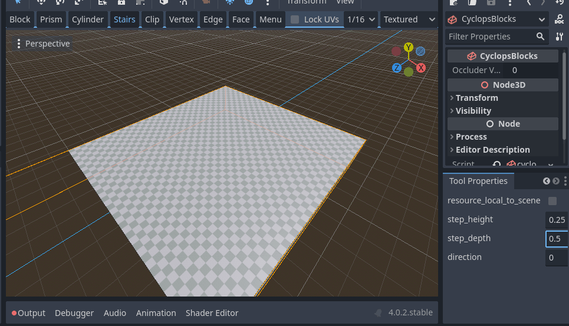

# Stairs Tool

The stairs tool lets you quickly draw sets of stairs.

* Click in empty space or on the surface of a block to place one corner of the base of your staircase.
     * Drag the mouse and release the button to define the base of the stairs area
     * Drag the mouse upwards to define the height of the staircase.  Stairs will created to be as close to the top of the dragged volume as possible.
     * Scroll the mouse wheel to change the direction the staircase is pointing.
     * Use Ctrl-Wheel to change the height of each step.  Ctrl-Shift-Wheel will change the depth of each step.
     * To cancel building the block, press the Escape key.  You can also right click with the mouse.

### Tool Properties

* Collision Type - Type of collision shape that will be created for this block when it is exported
* Collision Layers - Collision layer flags for created block
* Collision Mask - Collision mask flags for created block
* Alignment
    * Align to surface - The base of the block you're creating will lie along the surface of the nearest surface under the cursor
    * XY Plane - The base of the block will lie on the XY plane
    * XZ Plane - The base of the block will lie on the XZ plane
    * YZ Plane - The base of the block will lie on the YZ plane

* Match active block - Elevation and height properties of the block you are drawing will be copied from the current active block.  This will be in effect if you start drawing the block when the mouse is over an empty space or if `Alignment` has been set to something other than `Align to surface`.
* Orthogonal Viewport - These properties affect properties of the shape you create when you are drawing in an orthogonal viewport and you are not using the active block to define these properties
    * Default Block Elevation - Default elevation of block.
    * Default Block Height - Default height of block.

## Support

If you found this software useful, please consider buying me a coffee on Kofi.  Every contribution helps me to make more software:

